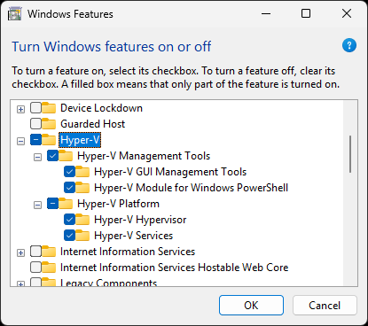
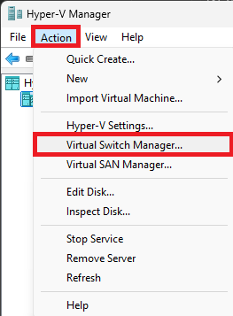
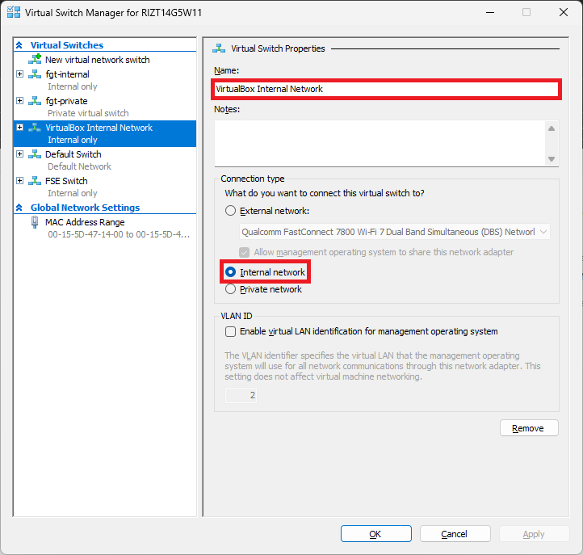
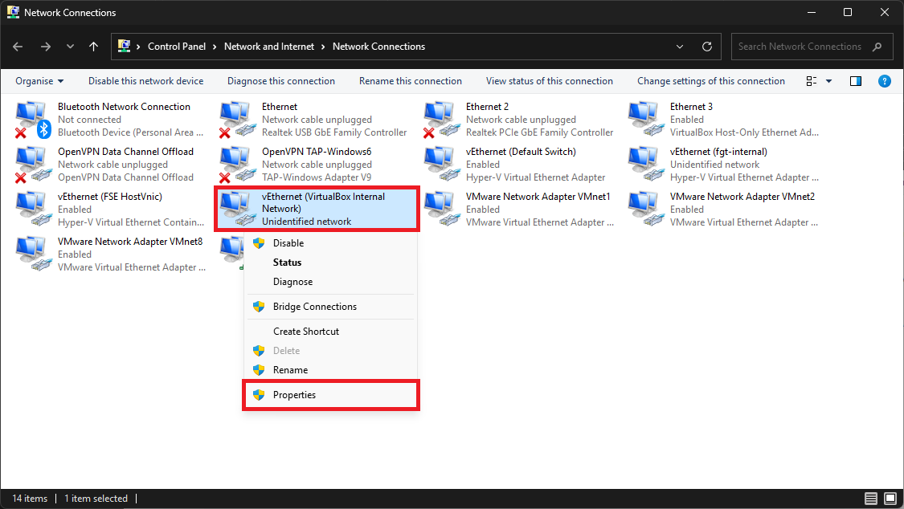
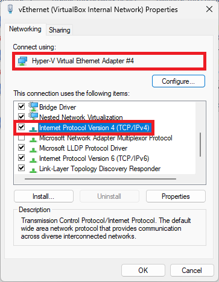
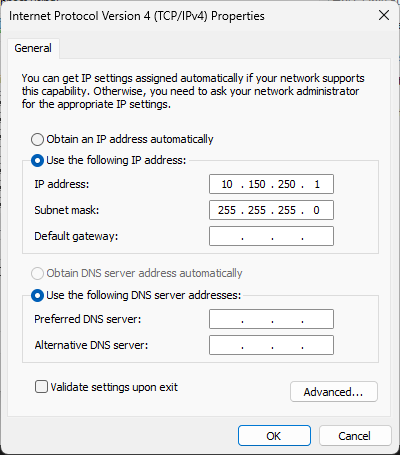

# VirtualBox (WSL 2)

!!! note

    The Docker CPI is the new recommended way for local development.

This guide will provide steps for spinning up a Windows VirtualBox BOSH
environment with the BOSH CLI via Windows Subsystem for Linux 2 (WSL 2).


## The Problem

Most BOSH CPIs (including VirtualBox), and by extension the `bosh create-env`
 command, do no support Windows. Therefore, it's recommended to run the
 command under WSL 2. However:

1. The VirtualBox CPI relies on the `VBoxManage` CLI and passes untransformed
    Linux paths for stemcell uploads
2. VirtualBox on WSL 2 is not supported
3. There is no route between VirtualBox's host-only networking and WSL 2
    (whether in NAT or [mirrored
    mode](https://github.com/microsoft/WSL/issues/14381)).


## Prerequisites

1. Install [WSL 2](https://learn.microsoft.com/en-us/windows/wsl/install)
2. Install the [`bosh` CLI](./cli-v2-install) on the WSL 2 environment
3. Install [VirtualBox](https://www.virtualbox.org/wiki/Downloads) on the
   Windows host


## Setup

!!! warning

    Following this guide will necessarily alter the security model such that
    the BOSH Director becomes routable to and from other virtual machines on
    the host machine rather than just the host operating system. For typical
    development machines where running VMs are trusted, this should not be an
    issue.


### Enabling the Hyper-V Windows Feature

This is needed to leverage Hyper-V's vSwitch to expose a network adapter with
a routable IP address. Our VirtualBox VMs will attach to this network adapter
instead of VirtualBox's host-only network.

1. Open "Turn Windows Features on or off" from the Start Menu.
2. Tick `Hyper-V` and its sub-features.
    
3. Press OK.
4. Restart the computer when isntructed.


### Create a Internal Hyper-V vSwitch Network

1. Open "Hyper-V Manager" from the Start Menu
2. Go to "Action" > "Virtual Switch Manager"

    

3. Under "Virtual Switches", click on "New virtual network switch"
4. Select "Internal" type
5. Click "Create Virtual Switch"
6. Set a name for the new vSwitch
7. Click OK

    


### Making the Network Adapter Routable

!!! tip

    When creating a vSwitch in the previous section, a network adapter managed
    by Hyper-V (called "vEthernet") is also created. Here, we'll configure
    this adapter to be routable.

1. Open "View network connections" from the Start Menu.
2. Right-click on the newly-created network adapter and click "Properties". It
   can be identified by the vSwitch name from the previous section:
   `vEthernet (<vSwitch Name>)`.

    

3. Note down the network adapter's name listed under "Connect using".

    !!! note
    
        Your network adapter name may differ from the example.

    

4. Double-click "Internet Protocol Version 4 (TCP/IPv4)" in the items list.
5. Select "Use the following IP address:".
6. Set the IP address and subnet mask.

    !!! note
    
        This example uses the subnet `10.150.250.0/24`, though it can be
        configured to any  unused subnet. `192.168.56.0/24` is not used to
        avoid conflict with the default VirtualBox host-only network.

    

7. Click OK on both dialog boxes to save changes.

### Adding `VBoxManage` CLI to WSL 2

In the WSL 2 environment, add the [VBoxManage WSL 2
wrapper](https://git.sr.ht/~achrinza/vboxmanage-wsl2-wrapper):

```shell
curl -LO  https://git.sr.ht/~achrinza/vboxmanage-wsl2-wrapper/blob/main/VBoxManage
chmod +x VBoxManage
sudo mv VBoxManage /usr/local/bin/
```


### Deploying the BOSH Director

Because the networking stack differs from what `bosh-deployment` covers,
we'll need to create a new Ops File:

```yaml title="virtualbox-wsl2.yml"
- name: /networks/name=default/subnets/0/cloud_properties?
  type: replace
  value:
    type: bridged
    # Replace this with your network adapter name:
    name: "Hyper-V Virtual Ethernet Adapter #4"
```

!!! note

    Do not confuse this with the *vSwitch* name. The network adapter name
    is autogenerated and should start with
    `Hyper-V Virtual Ethernet Adapter #`.

From there, we can follow the [standard VirtualBox
deployment](bosh-lite.md#install-director-vm), appending our new Ops File and
altering the `internal` network variables:

```diff
 bosh create-env ~/workspace/bosh-deployment/bosh.yml \
   --state ./state.json \
   -o ~/workspace/bosh-deployment/virtualbox/cpi.yml \
   -o ~/workspace/bosh-deployment/virtualbox/outbound-network.yml \
   -o ~/workspace/bosh-deployment/bosh-lite.yml \
   -o ~/workspace/bosh-deployment/bosh-lite-runc.yml \
   -o ~/workspace/bosh-deployment/uaa.yml \
   -o ~/workspace/bosh-deployment/credhub.yml \
   -o ~/workspace/bosh-deployment/jumpbox-user.yml \
+  -o ./virtualbox-wsl2.yml \
   --vars-store ./creds.yml \
   -v director_name=bosh-lite \
-  -v internal_ip=192.168.56.6 \
-  -v internal_gw=192.168.56.1 \
-  -v internal_cidr=192.168.56.0/24 \
+  -v internal_ip=10.150.250.6 \
+  -v internal_gw=10.150.250.1 \
+  -v internal_cidr=10.150.250.0/24 \
   -v outbound_network_name=NatNetwork
```

Then, we can alias the BOSH environment:

```shell
export BOSH_CLIENT=admin
export BOSH_CLIENT_SECRET=`bosh int ./creds.yml --path /admin_password`
bosh alias-env vbox -e 10.150.250.6 --ca-cert <(bosh int ./creds.yml --path /director_ssl/ca)
```

## Next Steps

To start testing out BOSH, try [deploying Zookeeper](bosh-lite.md#deploy).
